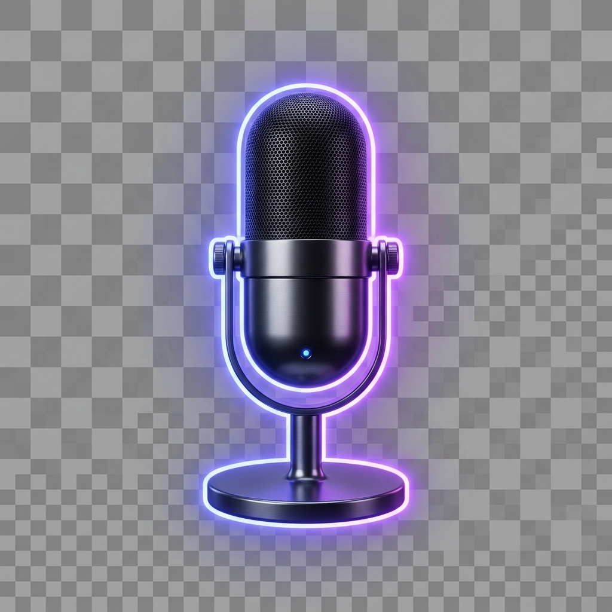

# MeetingActionAgent 🤖

> **Agents League Hackathon 2026 — Enterprise Agents Track**
> Powered by Azure AI Foundry + Microsoft Work IQ + GitHub + Notion + SendGrid + Jira

## 🎥 Demo

> [Add your demo video link here after recording]



## 💡 What it does

**MeetingActionAgent** automatically transforms meeting audio or transcripts into structured, synced action items across your entire enterprise toolchain — in seconds.

- 🎙️ **Records live** meeting audio from your microphone (with Auto-Pilot voice detection)
- 📂 **Accepts uploads** of .mp3/.wav/.m4a audio files
- 📋 **Paste transcripts** directly or import .vtt/.srt subtitle files
- 🔗 **Connects live** to Google Meet, Microsoft Teams, or Zoom meetings
- 🧠 **Extracts** action items, owners, deadlines, priorities, and decisions using Azure AI Foundry
- 🐙 **Creates GitHub Issues** for every technical task automatically
- 📓 **Creates Notion pages** for task tracking and meeting summaries
- 📧 **Sends email summaries** to all participants via SendGrid
- 🎫 **Creates Jira tickets** for your project board
- 🤖 **Uses Microsoft Work IQ** for workplace context and people enrichment

## 🏗️ Architecture

```
Meeting Input (Audio / Transcript / Live Meet)
              ↓
    Azure Whisper (Speech-to-Text)
              ↓
  Azure AI Foundry — gpt-4.1-mini
  + Microsoft Work IQ (people/org context)
              ↓
      Structured JSON (tasks, decisions, summary)
              ↓
  ┌──────────┬──────────┬──────────┬──────────┐
  ↓          ↓          ↓          ↓          ↓
GitHub    Notion     SendGrid    Jira     Console
Issues    Pages      Email    Tickets      ✅
```

## 🔷 Microsoft IQ Integration

This project integrates **Foundry IQ** + **Work IQ**:

| IQ Layer | How it's used |
|---|---|
| **Foundry IQ** | Azure AI Foundry hosts gpt-4.1-mini for transcript analysis & structured extraction |
| **Work IQ** | Enriches action items with employee context, team roles, and org structure |

## 🛠️ Tech Stack

| Layer | Technology |
|---|---|
| AI Core | Azure AI Foundry (gpt-4.1-mini) |
| Speech-to-Text | Azure Whisper |
| IQ Layers | Microsoft Foundry IQ + Work IQ |
| Backend | Python 3.10+ / FastAPI |
| Task Tracking | GitHub Issues API |
| Project Mgmt | Notion API |
| Email | SendGrid |
| Bug Tracking | Jira Software API |
| Frontend | Vanilla HTML/CSS/JS (glassmorphic dark UI) |

## 🚀 Quick Start

### 1. Clone the repo
```bash
git clone https://github.com/Akshatmish/meeting-action-agent
cd meeting-action-agent
```

### 2. Install dependencies
```bash
pip install -r requirements.txt
```

### 3. Configure environment
```bash
cp .env.example .env
# Edit .env and add your API keys
```

### 4. Run the server
```bash
uvicorn app:app --reload
```

### 5. Open the UI
```
http://localhost:8000
```

## 🔐 Environment Variables

See [`.env.example`](.env.example) for all variables. Key ones:

| Variable | Required | Description |
|---|---|---|
| `AZURE_API_KEY` | ✅ | Azure AI Foundry API key |
| `AZURE_ENDPOINT` | ✅ | Azure OpenAI endpoint URL |
| `GITHUB_PAT` | Optional | GitHub Personal Access Token |
| `NOTION_TOKEN` | Optional | Notion integration token |
| `NOTION_DATABASE_ID` | Optional | Notion database ID |
| `SENDGRID_API_KEY` | Optional | SendGrid API key |
| `JIRA_API_TOKEN` | Optional | Jira API token |

> **Tip:** You can also configure all keys directly in the UI's **API Credentials** panel — they're saved securely in your browser's localStorage.

## 🎯 Features

- ✨ **Auto-Pilot Mode** — hands-free voice-activated recording
- 🌐 **Live Meeting Connect** — simulates real-time transcription from Meet/Teams/Zoom URLs
- 🔄 **Real-time pipeline stepper** — visual progress for each integration step
- 📊 **Results dashboard** — metrics, action items table, synced integration links
- 🔑 **In-UI credentials panel** — configure API keys without touching `.env`

## 📄 License

MIT — Built for Agents League Hackathon 2026

